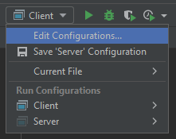

# Software Distribuït 2023

| Professor    | Mail            | Classes                                                               |
|--------------|-----------------|-----------------------------------------------------------------------|
| Eloi Puertas | epuertas@ub.edu | Teoria, dimecres de 15 a 17h. Pràctiques, dijous de 17 a 19h (Grup B) |
| Blai Ras     | blai.ras@ub.edu | Pràctiques, dimecres de 17 a 19h (Grup F) i de 19 a 21h (Grup A)      |

## Avaluació

* Es treballarà amb GitHub Classroom, on cada parella tindrà un repositori. És obligatori que tota la feina realitzada es vegi **contrastada a GitHub de manera continuada**, és a dir, no pot haver-hi un "push" enorme el dia abans de l'entrega amb tot el codi de la P1. A l'apartat de P1 trobareu totes les directrius a seguir.

* L'assistència a classe és obligatoria. A cada sessió el professor explicarà el progrès a realitzar de la pràctica, a part de resoldre dubtes. Cada dues sessions, els últims 10-15 minuts estàn reservats per a un qüestionari obligatori sobre temari de teòria i pràctiques que s'ha tractat durant les dues últimes setmanes. Aquest qüestionari és individual, sense internet, està cronometrat i només es podrà realitzar un sol cop.

* No hi ha exàmen parcial

| Concepte                                                      | Tipus de nota | Pes |
|---------------------------------------------------------------|---------------|-----|
| Codi P1                                                       | Col·lectiva   | 0.5 |
| Qüestionari cada 15 dies                                      | Individual    | 0.3 |
| Avaluació de GitHub (Pull Requests, Feedback, continuïtat...) | Individual    | 0.2 |

## P1 - Client / Servidor

La practica 1 consisteix en implementar un joc senzill amb arquitectura Client-Servidor fent servir Sockets amb Java. Establirem un protocol i els seus estats a seguir de manera que qualsevol grup podrà testejar el seu Client contra qualsevol Servidor d'un altre grup, i viceversa.

* Es programarà en Java. Es recomana usar una SDK recent, per exemple, la 18. És també recomanat l'ús de Linux.
* Es seguirà estrictament la [guia d'estil de JAVA](https://google.github.io/styleguide/javaguide.html) per la primera pràctica tan pel que fa al codi com a la documentació.
* Podeu fer servir el IntelliJ IDEA amb llicència d'estudiant de la UB que integra en l'IDE  eines per a [Github](https://www.jetbrains.com/help/idea/github.html) i per [reformatar codi segons una guia d'estil](https://medium.com/swlh/configuring-google-style-guide-for-java-for-intellij-c727af4ef248)
* La última sessió de cada pràctica serà de testing creuat.

**Avaluació de GitHub**

* El conjunt de **commits** d'un membre de la parella dins la seva branca s'hauran de revisar (**code review**) per l'altra membre abans de fer _merge_ a la branca principal. Es farà mitjançant[ **Pull Requests**,](https://docs.github.com/en/github/collaborating-with-issues-and-pull-requests/proposing-changes-to-your-work-with-pull-requests) per tant no es podrà seguir desenvolupant fins que l'altre membre de la parella no acceptin els canvis en el codi proposats. Es poden fer tants PR com es vulgui, com mes _feedback_ entre la parella, millor.
* Per acceptar els canvis, el revisor ha de llegir-se el codi, comprovar que segueix els estàndards i provar els tests.  En cas de trobar coses per millorar o TESTS que faltin, ho ha d'explicar en el comentaris del  **Pull Request** i no acceptar els canvis fins que l'altra ho millori. En cas de que estigui tot correcte ha de comentar els canvis realitzats i les proves que ha fet.  

### Sessió 0

En aquesta sessió donem a conèixer el codi base, s'expliquen les diferents parts i com millorar-lo. En aquesta sessió teniu dos projectes: Client i Servidor. Obriu cadascún com a dos projecetes separats a IntelliJ. 

### Execució 

L'execució seguirà obligatòriament els següents paràmetres:

**Client**
* -p: port a on connectar-se

**Servidor**

* -h: IP o nom de la màquina
* -p: port a on establir-se

Podeu executar-ho usant la consola, o podeu editar les _run configurations_ del projecte tal i com es mostra a continuació:

i després...

#### Tasques a realitzar per a la sessió 1

* Documentarse sobre [Sockets en Java](https://docs.oracle.com/javase/7/docs/api/java/net/Socket.html)
* Entendre el codi base, executar-lo i experimentar.
* Modificar el codi per a implementar les classes GameHandler i GameClient.
